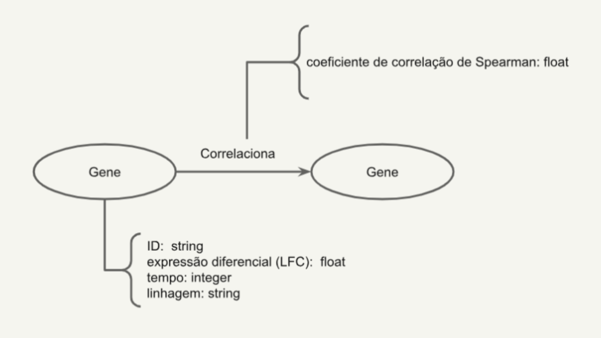

# Primeira Entrega
*2026.1 Ciência e Visualização de Dados em Saúde*

# Projeto `Dinâmica Temporal e Redes de Coexpressão Gênica da Diferenciação de Células-Tronco Embrionárias`
# Project `Temporal Dynamics and Gene Co-expression Networks of Embryonic Stem Cell Differentiation`

# Descrição Resumida do Projeto

Este projeto tem como principal objetivo analisar e comparar a dinâmica temporal da expressão gênica durante a diferenciação de células-tronco embrionárias humanas (hESCs) em duas linhagens distintas: cardiomiócitos (mesoderme) e células polihormonais pancreáticas (endoderme).

Apesar de compartilharem o mesmo genoma, tais células adquirem identidades distintas ao longo de seu processo de diferenciação, resultado de mudanças coordenadas na regulação gênica, da ativação de vias biológicas específicas e do desenvolvimento de interações moleculares únicas. Dessa forma, a compreensão das dinâmicas que regem o processo de diferenciação celular mostra-se essencial para a elucidação dos mecanismos subjacentes ao desenvolvimento embrionário e, consequentemente, para a identificação de potenciais alvos moleculares em aplicações de medicina regenerativa.

Sendo assim, utilizando dados públicos de RNA-seq com resolução temporal, o projeto propõe integrar análise de expressão diferencial, enriquecimento funcional e ciência de redes para a identificação de padrões comuns e específicos entre as duas linhagens celulares estudadas. Nesse sentido, espera-se que redes de coexpressão gênica sejam construídas e analisadas quanto a suas propriedades topológicas ao longo do intervalo analisado, permitindo a identificação de genes centrais, módulos funcionais e eventos críticos no processo de diferenciação celular.

# Slides

[Apresentação da Entrega 01 do Projeto da Disciplina](assets/slides/Project1_presentation_COMBI.pdf)

# Fundamentação Teórica

- Keskin et al. (2025, 2026): Textos base para o entendimento completo dos dados que serão utilizados nas análises;

- Trapnell et al. (2014): Exemplo prático de análises possíveis para dados transcriptômicos obtidos ao longo do processo de diferenciação celular;

- Zakrzewski et al. (2019), Campbell et al. (2019), Mao and Mooney (2015): Revisões gerais detalhando conceitos como medicina regenerativa e diferenciação celular.

De maneira geral, o conceito de célula-tronco estende-se ao conjunto de células com alto grau de potencialidade e baixo estado de diferenciação, as quais estão aptas à originar tipos celulares específicos, a partir do processo de diferenciação celular (Campbell et al., 2019). No que diz respeito à sua potencialidade, uma célula-tronco pode ser classificada sob grupos distintos, estes representativos de seu poder de diferenciação, a saber: células totipotentes, capazes de originar todos os tipos celulares de um organismo (zigoto, por exemplo); células pluripotentes (PSCs - do inglês, Pluripotent Stem Cells), incapazes de diferenciar-se em estruturas extraembrionárias, como a placenta, porém aptas a originar linhagens pertencentes aos três folhetos embrionários (endoderme, mesoderme e ectoderme); células multipotentes, cujo alcance de diferenciação mostra-se menor do que aquele identificado em PSCs, mas ainda capazes de diferenciar-se em linhagens celulares específicas; células unipotentes, limitadas a diferenciação em um único tipo celular específico (Campbell et al., 2019, Zakrzewski et al., 2019). 

Adicionalmente, as células-tronco podem ainda ser classificadas quanto ao seu modo de origem, em: células adultas; células-tronco pluripotentes induzidas (iPSCs - do inglês, Induced pluripotent stem cells); células embrionárias (ESCs - do inglês, Embryonic stem cells) (Campbell et al., 2019). Tendo em vista essa alta capacidade de diferenciação em tipos celulares específicos, muito se tem estudado a respeito da aplicação de células-tronco em estudos de medicina regenerativa, sendo uma alternativa segura ao transplante de órgãos e suas limitações inerentes (Mao and Mooney, 2015). No entanto, os mecanismos moleculares subjacentes ao processo de diferenciação celular apresentam-se com elevado grau de complexidade, uma vez que redes regulatórias robustas integram sinais temporais, espaciais, genéticos e ambientais na manutenção da especificação correta de uma ampla gama de linhagens celulares. Dessa forma, levando em conta a dinamicidade de tal processo, o entendimento completo acerca das etapas de diferenciação de células-tronco em tecidos específicos demanda a avaliação rigorosa de variáveis experimentais distintas.  

Nesse sentido, como evidenciado por Trapnell et al. (2014), a diferenciação celular mostra-se como um processo dinâmico e contínuo, no qual estados intermediários podem ser identificados por meio da análise temporal da expressão gênica, permitindo a identificação de transições críticas no destino celular. Baseando-se neste mesmo princípio, em seus estudos, Keskin et al. (2025, 2026) demonstraram que a diferenciação de células tronco embrionárias humanas (hESCs) em cardiomiócitos e células polihormonais envolve mudanças coordenadas na expressão gênica ao longo de múltiplos estágios temporais, levando à ativação progressiva de vias metabólicas e regulatórias específicas. À vista disso, a geração de novos dados experimentais referentes às etapas do processo de diferenciação de hESCs em tipos celulares específicos fornece material suficiente para a criação de modelos computacionais robustos, os quais cruciais para a resolução de questões ainda não esclarecidas sobre os mecanismos particulares à diferenciação celular. 

# Perguntas de Pesquisa

- Existe diferença entre as dinâmicas de expressão gênica encontradas ao longo do processo de diferenciação de células-tronco pluripotentes em cardiomiócitos e células polihormonais?

- Como a dinâmica temporal das redes de coexpressão gênica influencia o processo de diferenciação de células-tronco embrionárias humanas em cardiomiócitos e células pancreáticas?

## Hipóteses a serem testadas

- H0: A dinâmica da expressão gênica ao longo do processo de diferenciação de células-tronco pluripotentes em cardiomiócitos é idêntica àquela observada na diferenciação de células polihormonais. 

- H1: A dinâmica da expressão gênica ao longo do processo de diferenciação de células-tronco pluripotentes em cardiomiócitos é distinta àquela observada na diferenciação de células polihormonais.

# Bases de Dados

A base de dados está disponível no Gene Expression Omnibus pelos números de acesso: GSE274620 (Keskin et al., 2025a) e GSE305933 (Keskin et al., 2025b). Ambos foram utilizados em estudo anterior para avaliar o perfil multi-ômico de células-tronco embrionárias. Para a autenticação e controle de qualidade, os autores compararam os conjuntos de dados com a linhagem RUES2 hESC (HPSCREG, 2026), disponibilizada pela The Rockefeller University.

> Base de Dados | Endereço na Web | Resumo descritivo
> ----- | ----- | -----
> GSE274620 | [URL NCBI](https://www.ncbi.nlm.nih.gov/geo/query/acc.cgi?acc=GSE274620) | Proveniente do Gene Expression Omnibus. Amostras de RNA-seq da linhagem mesoderme de células tronco. Diferenciação em cardiomiócitos com série temporal.
> GSE305933 | [URL NCBI](https://www.ncbi.nlm.nih.gov/geo/query/acc.cgi?acc=GSE305933) | Proveniente do Gene Expression Omnibus. Amostras de RNA-seq da linhagem endoderme de células tronco. Diferenciação em células pancreáticas polihormonais  com série temporal.
> SAMEA104387770 | [URL hPSCreg](https://hpscreg.eu/cell-line/RUESe002-A) | Proveninete do hPSCreg. Amostras de RNA-seq de células tronco embrionárias. Diferenciação de blastocistos em endoderme, ectoderme e mesoderme.

# Modelo Lógico

> 

# Metodologia

Com o objetivo de comparar a dinâmica da expressão gênica entre as linhagens mesodérmica (cardiomiócitos) e endodérmica (células polihormonais), será realizada uma análise temporal de expressão gênica diferencial a partir de dados de RNA-seq. Inicialmente, cada linhagem será comparada a um grupo controle correspondente a células-tronco embrionárias pluripotentes (RUES2), em três pontos temporais definidos com base nos estudos de Keskin et al., 2025 e Keskin et al., 2026:

- i. dia 0 (estado pluripotente);
- ii. dia 3 (início da diferenciação, com especificação de linhagem);
- iii. dia 17 (estado diferenciado).

A partir dessas comparações, serão obtidos conjuntos de genes diferencialmente expressos (DEGs) para cada linhagem em cada tempo, totalizando seis conjuntos principais. Em seguida, os genes diferencialmente expressos serão utilizados para a construção de redes de coexpressão gênica, nas quais os nós representam genes e as arestas representam relações de correlação entre seus perfis de expressão ao longo do tempo para cada amostra.

As redes serão construídas com base em medidas de correlação (como correlação de Pearson ou Spearman), permitindo identificar padrões de co-regulação gênica. A análise dessas redes poderá envolver métricas de centralidade como degree, betweenness e eigenvector, para assim identificar genes centrais (hubs), que podem desempenhar papéis regulatórios importantes no processo de diferenciação celular. Além disso, o uso do algoritmo de Louvain será testado para identificar comunidades; necessário neste contexto para prever módulos de genes coexpressos, que estão potencialmente associados a funções biológicas específicas ou vias regulatórias. No entanto, análises comparativas entre redes são essenciais para identificar diferenças estruturais entre as redes de cada linhagem ao longo do tempo, evidenciando processos biológicos específicos da mesoderme e da endoderme.

Assim, para a análise da dinâmica temporal das redes de coexpressão gênica, cada rede será construída de maneira independente para cada ponto temporal analisado. Serão comparadas as propriedades topológicas das redes ao longo do tempo, como densidade, centralidade e estrutura de comunidades. O objetivo é identificar mudanças estruturais associadas ao processo de diferenciação celular, de modo que estas alterações possam ser interpretadas como pontos críticos de transição, nos quais ocorrem reorganizações significativas nas interações gênicas, que refletem alterações no estado celular. A identificação desses pontos permitirá inferir momentos-chave do processo de diferenciação em que há ativação de programas regulatórios específicos para cada linhagem.

# Ferramentas
Como pretendemos avaliar os perfis de expressão gênicas e suas correlações ao longo do tempo para cada linhagem celular, usaremos como base a metodologia descrita pelos artigos de Keskin et al., 2025 e Keskin et al., 2026. Adicionamos etapas descritas em workflows anteriores, como análises de redes, que permitem identificar correlações intrínsecas entre genes. A seguir, serão descritas, de maneira breve, quais as ferramentas e softwares que serão utilizados para cada uma das etapas do trabalho.

## Pré-processamento de dados

> Software/Ferramenta | Função | Citação
> ----- | ----- | -----
> FastQC | Controle de qualidade | [Wingett et al., 2018] 
> Trimmomatic | Limpeza dos dados | [Bolger et al., 2014] 
> HISAT2 ou STAR | Mapeamento | HISAT2: [Wen et al., 2017], STAR: [Dobin et al., 2013] 
> Plastid (pacote Python) ou StringTie | Contagem dos transcritos | Plastid: [Keskin et al., 2026], StringTie: [Pertea et al., 2015]

## Análise de Expressão Diferencial

> Software/Ferramenta | Função | Citação
> ----- | ----- | -----
> DESeq2 | Análise de expressão diferencial | [Love et al., 2014]

## Anotação e Análise de Enriquecimento de Vias

> Software/Ferramenta | Função | Citação
> ----- | ----- | -----
> Bibliotecas R: clusterProfiler, org.Hs.eg.db e AnnotationDbi | Anotação funcional | clusterProfiler: [Yu G, 2024], org.Hs.eg.db: [Carlson M, 2017], AnnotationDbi: [Pagès et al., 2025]
> Bibliotecas R: enrichplot | Enriquecimento de vias | [Yu et al., 2026]

## Análise de Redes

> Software/Ferramenta | Função | Citação
> ----- | ----- | -----
> WGCNA | Análises de correlação | [Langfelder et al., 2008]
> GEPHI ou Cytoscape | Construção e análise das redes de correlação | GEPHI: [Bastian et al., 2009], Cytoscape: [Shannon et al., 2003]

# Referências Bibliográficas

[Bastian et al., 2009] Bastian, M.; Heymann, S.; Jacomy, M. Gephi: an open source software for exploring and manipulating networks. In: Proceedings of the 3rd International AAAI Conference on Web and Social Media. Burnaby, Canada, 2009. p. 361–362.

[Bolger et al., 2014] Bolger, A. M.; Lohse, M.; Usadel, B. Trimmomatic: a flexible trimmer for Illumina sequence data. Bioinformatics, v. 30, n. 15, p. 2114–2120, 2014.

[Campbell et al., 2019] Campbell, Madeline et al. Stem cell spheroids. 2019.

[Carlson, 2017] Carlson, M. org.Hs.eg.db: Genome wide annotation for Human. R package version 3.5.0, 2017.

[Dobin et al., 2013] Dobin, A. et al. STAR: ultrafast universal RNA-seq aligner. Bioinformatics, v. 29, n. 1, p. 15–21, 2013. doi:10.1093/bioinformatics/bts635.

[Dvash et al., 2006] Dvash, T.; Ben-Yosef, D.; Eiges, R. Human embryonic stem cells as a powerful tool for studying human embryogenesis. Pediatric Research, v. 60, p. 111–117, 2006. doi:10.1203/01.pdr.0000228349.24676.17.

[HPSCREG, 2026] HPSCREG. Human Pluripotent Stem Cell Registry. Disponível em: hpscreg.eu. Acesso em: 19 mar. 2026.

[Keskin et al., 2025] Keskin, A.; Shayya, H. J.; Sirabella, D. et al. Temporal multiomics gene expression data of human embryonic stem cell-derived cardiomyocyte differentiation. Scientific Data, v. 12, p. 1308, 2025. doi:10.1038/s41597-025-05655-9.

[Keskin et al., 2025a] Keskin, A. et al. Temporal multiomics gene expression data of human embryonic stem cell-derived cardiomyocyte differentiation. NCBI Gene Expression Omnibus (GEO), 2025. Disponível em: https://identifiers.org/geo/GSE274620.

[Keskin et al., 2025b] Keskin, A. et al. Temporal multiomics gene expression data across human embryonic stem cell-derived polyhormonal cell differentiation. NCBI Gene Expression Omnibus (GEO), 2025. Disponível em: https://identifiers.org/geo/GSE305933.

[Keskin et al., 2026] Keskin, A.; Shayya, H. J.; Patel, A. et al. Temporal multiomics gene expression data across human embryonic stem cell-derived polyhormonal cell differentiation. Scientific Data, v. 13, p. 278, 2026. doi:10.1038/s41597-026-06606-8.

[Langfelder; Horvath, 2008] Langfelder, P.; Horvath, S. WGCNA: an R package for weighted correlation network analysis. BMC Bioinformatics, v. 9, p. 559, 2008.

[Lee; Lee, 2011] Lee, J. E.; Lee, D. R. Human embryonic stem cells: derivation, maintenance and cryopreservation. International Journal of Stem Cells, v. 4, n. 1, p. 9–17, 2011. doi:10.15283/ijsc.2011.4.1.9.

[Love et al., 2014] Love, M. I.; Huber, W.; Anders, S. Moderated estimation of fold change and dispersion for RNA-seq data with DESeq2. Genome Biology, v. 15, p. 550, 2014.

[Mao and Mooney, 2015] Mao, Angelo S.; Mooney, David J. Regenerative medicine: Current therapies and future directions. Proceedings of the National Academy of Sciences, v. 112, n. 47, p. 14452-14459, 2015.

[Pagès et al., 2025] Pagès, H. et al. AnnotationDbi: manipulation of SQLite-based annotations in Bioconductor. R package version 1.72.0, 2025. Disponível em: https://bioconductor.org/packages/AnnotationDbi.

[Pertea et al., 2015] Pertea, M. et al. StringTie enables improved reconstruction of a transcriptome from RNA-seq reads. Nature Biotechnology, v. 33, n. 3, p. 290–295, 2015. doi:10.1038/nbt.3122.

[Shannon et al., 2003] Shannon, P. et al. Cytoscape: a software environment for integrated models of biomolecular interaction networks. Genome Research, v. 13, n. 11, p. 2498–2504, 2003.

[Thomson et al., 1998] Thomson, J. A. et al. Embryonic stem cell lines derived from human blastocysts. Science, v. 282, n. 5391, p. 1145–1147, 1998. doi:10.1126/science.282.5391.1145.

[Trapnell et al., 2014] Trapnell, C. et al. The dynamics and regulators of cell fate decisions are revealed by pseudotemporal ordering of single cells. Nature Biotechnology, v. 32, n. 4, p. 381–386, 2014. doi:10.1038/nbt.2859.

[Wen, 2017] Wen, G. A simple process of RNA-sequence analyses by Hisat2, Htseq and DESeq2. In: Proceedings of the International Conference on Biomedical Engineering and Bioinformatics. 2017. p. 11–15.

[Wingett; Andrews, 2018] Wingett, S. W.; Andrews, S. FastQ Screen: a tool for multi-genome mapping and quality control. F1000Research, v. 7, p. 1338, 2018. doi:10.12688/f1000research.15931.2.

[Yu, 2024] Yu, G. Thirteen years of clusterProfiler. The Innovation, v. 5, n. 6, p. 100722, 2024. doi:10.1016/j.xinn.2024.100722.

[Yu, 2026] Yu, G. enrichplot: visualization of functional enrichment result. R package version 1.30.5, 2026. Disponível em: https://bioconductor.org/packages/enrichplot.

[Zakrzewski et al., 2019] Zakrzewski, Wojciech et al. Stem cells: past, present, and future. Stem cell research & therapy, v. 10, n. 1, p. 68, 2019.
