# Terceira Entrega
*2026.1 Ciência e Visualização de Dados em Saúde*

# Projeto `Dinâmica Temporal e Redes de Coexpressão Gênica da Diferenciação de Células-Tronco Embrionárias`
# Project `Temporal Dynamics and Gene Co-expression Networks of Embryonic Stem Cell Differentiation`

# 1. Descrição Resumida do Projeto

Este projeto tem como principal objetivo analisar e comparar a dinâmica temporal da expressão gênica durante a diferenciação de células-tronco embrionárias humanas (hESCs) em duas linhagens distintas: cardiomiócitos (mesoderme) e células polihormonais pancreáticas (endoderme).

Apesar de compartilharem o mesmo genoma, tais células adquirem identidades distintas ao longo de seu processo de diferenciação, resultado de mudanças coordenadas na regulação gênica, da ativação de vias biológicas específicas e do desenvolvimento de interações moleculares únicas. Dessa forma, a compreensão das dinâmicas que regem o processo de diferenciação celular mostra-se essencial para a elucidação dos mecanismos subjacentes ao desenvolvimento embrionário e, consequentemente, para a identificação de potenciais alvos moleculares em aplicações de medicina regenerativa.

Sendo assim, utilizando dados públicos de RNA-seq com resolução temporal, o projeto propõe integrar análise de expressão diferencial, enriquecimento funcional e ciência de redes para a identificação de padrões comuns e específicos entre as duas linhagens celulares estudadas. Nesse sentido, espera-se que redes de coexpressão gênica sejam construídas e analisadas quanto a suas propriedades topológicas ao longo do intervalo analisado, permitindo a identificação de genes centrais, módulos funcionais e eventos críticos no processo de diferenciação celular.

# 2. Slides

> [Apresentação da Entrega 03 do Projeto da Disciplina](assets/slides/entrega03.pdf)

# 3. Fundamentação Teórica
- **Campbell et al. (2019)**: Definição de células-tronco como células com alta potencialidade e baixo grau de diferenciação. Classificação das células-tronco quanto à potencialidade (totipotentes, pluripotentes, multipotentes e unipotentes);

- **Zakrzewski et al. (2019)**: Complementação da classificação funcional das células-tronco e seus diferentes níveis de diferenciação;

- **Campbell et al. (2019)**: Classificação das células-tronco quanto à origem (adultas, iPSCs e embrionárias);

- **Mao and Mooney (2015)**: Aplicação de células-tronco na medicina regenerativa como alternativa ao transplante de órgãos;

- **Trapnell et al. (2014)**: Diferenciação celular como processo dinâmico e contínuo, analisável por expressão gênica ao longo do tempo;

- **Keskin et al. (2025, 2026)**: Análise da diferenciação de hESCs em diferentes linhagens com base em mudanças temporais na expressão gênica. Base experimental para construção de modelos computacionais aplicados ao estudo da diferenciação celular.

# 4. Perguntas de Pesquisa

- Existe diferença entre as dinâmicas de expressão gênica encontradas ao longo do processo de diferenciação de células-tronco pluripotentes em cardiomiócitos e células polihormonais?

- Como a dinâmica temporal das redes de coexpressão gênica influencia o processo de diferenciação de células-tronco embrionárias humanas em cardiomiócitos e células pancreáticas?

## 4.1. Hipóteses a serem testadas

- H0: A dinâmica da expressão gênica ao longo do processo de diferenciação de células-tronco pluripotentes em cardiomiócitos é idêntica àquela observada na diferenciação de células polihormonais. 

- H1: A dinâmica da expressão gênica ao longo do processo de diferenciação de células-tronco pluripotentes em cardiomiócitos é distinta àquela observada na diferenciação de células polihormonais.

# 5. Metodologia

Com o objetivo de comparar a dinâmica da expressão gênica entre as linhagens mesodérmica (cardiomiócitos) e endodérmica (células polihormonais), será realizada uma análise temporal de expressão gênica diferencial a partir de dados de RNA-seq. Inicialmente, cada linhagem será comparada a um grupo controle correspondente a células-tronco embrionárias pluripotentes (RUES2), em todos os pontos temporais definidos com base nos estudos de Keskin et al. (2025) e Keskin et al. (2026). Os dias iniciais correspondem ao estado pluripotente das células. Com o passar do tempo, inicia-se o processo de diferenciação, com especificação de linhagem. Ao final do período experimental, as células atingem o estado diferenciado, ou seja, quando há especificidade celular. A seleção de todos os dias do experimento ocorreu durante o desenvolvimento do projeto, quando percebeu-se a necessidade de incorporá-los para que as análises ficassem mais robustas. 

A partir dessas comparações, foram obtidos conjuntos de genes diferencialmente expressos (DEGs) para cada linhagem em cada tempo, totalizando nove conjuntos principais. Em seguida, os genes diferencialmente expressos foram utilizados para a construção de redes de coexpressão gênica, nas quais os nós representam genes e as arestas representam relações de correlação entre seus perfis de expressão ao longo do tempo para cada amostra.

As redes foram construídas com base em medidas de correlação de Pearson, permitindo identificar padrões de co-regulação gênica. A análise das redes envolveu métricas de centralidade como degree, betweenness e eigenvector, para assim identificar genes centrais (hubs), os quais capazes de desempenhar papéis regulatórios importantes no processo de diferenciação celular. Além disso, o uso do algoritmo de Leiden foi utilizado para identificar comunidades; necessário neste contexto para prever módulos de genes coexpressos, que estão potencialmente associados a funções biológicas específicas ou vias regulatórias. No entanto, análises comparativas entre redes são essenciais para identificar diferenças estruturais entre as redes de cada linhagem ao longo do tempo, evidenciando processos biológicos específicos da mesoderme e da endoderme.

Assim, para a análise da dinâmica temporal das redes de coexpressão gênica, cada rede foi construída de maneira independente para cada ponto temporal analisado. Dessa forma, foram comparadas as propriedades topológicas das redes ao longo do tempo, como densidade, centralidade e estrutura de comunidades. O objetivo foi identificar mudanças estruturais associadas ao processo de diferenciação celular, de modo que estas alterações possam ser interpretadas como pontos críticos de transição, nos quais reorganizações significativas nas interações gênicas se sucedem, que refletem alterações no estado celular. A identificação desses pontos permite inferir momentos-chave do processo de diferenciação em que há ativação de programas regulatórios específicos para cada linhagem.	

## 5.1 Bases de Dados e Evolução

A base de dados está disponível no Gene Expression Omnibus, a partir  dos estudos de Keskin et al. (2025, 2026) e referenciada pelos números de acesso: GSE274620 (Keskin et al., 2025a) e GSE305933 (Keskin et al., 2025b). Ambos datasets foram utilizados para avaliar o perfil multi-ômico de células-tronco embrionárias. Para a autenticação e controle de qualidade, os autores compararam os conjuntos de dados com a linhagem RUES2 hESC (HPSCREG, 2026), disponibilizada pela The Rockefeller University. 

> Base de Dados | Endereço na Web | Resumo descritivo | Tamanho | 
> ----- | ----- | ----- | ----- 
> GSE274620 | [URL NCBI](https://www.ncbi.nlm.nih.gov/geo/query/acc.cgi?acc=GSE274620) | Proveniente do Gene Expression Omnibus. Amostras de RNA-seq da linhagem mesoderme de células tronco. Diferenciação em cardiomiócitos com série temporal. | 29.55GB | 
> GSE305933 | [URL NCBI](https://www.ncbi.nlm.nih.gov/geo/query/acc.cgi?acc=GSE305933) | Proveniente do Gene Expression Omnibus. Amostras de RNA-seq da linhagem endoderme de células tronco. Diferenciação em células pancreáticas polihormonais com série temporal. | 27.27 GB |

O dataset GSE274620 foi gerado a partir da diferenciação de hESCs em cardiomiócitos, representando a linhagem mesodérmica. Esse conjunto contém 10 amostras coletadas em diferentes pontos temporais ao longo do processo de diferenciação, com medições de expressão gênica obtidas por RNA-seq, realizadas em duplicata (Tabela 1).

### Tabela 1 - Dias de coleta do transcriptoma da linhagem cardíaca

| Run | Time |
|------|------|
| SRR30214233 | Day0 |
| SRR30214243 | Day0 |
| SRR30214242 | Day1 |
| SRR30214232 | Day1 |
| SRR30214241 | Day2 |
| SRR30214231 | Day2 |
| SRR30214230 | Day3 |
| SRR30214240 | Day3 |
| SRR30214239 | Day4 |
| SRR30214229 | Day4 |
| SRR30214238 | Day6 |
| SRR30214228 | Day6 |
| SRR30214237 | Day8 |
| SRR30214227 | Day8 |
| SRR30214236 | Day10 |
| SRR30214226 | Day10 |
| SRR30214235 | Day12 |
| SRR30214225 | Day12 |
| SRR30214224 | Day18 |
| SRR30214234 | Day18 |

 De forma análoga, o dataset GSE305933 descreve a diferenciação de hESCs em células pancreáticas polihormonais, representando a linhagem endodérmica, seguindo o mesmo desenho experimental e estratégia de quantificação (Tabela 2). 

### Tabela 2. Respectivos dias de realização de coleta de transcriptoma para a linhagem polihormonal e seus identificadores experimentais.

| Run | Tempo |
|------|------|
| SRR35049363 | Day0 |
| SRR35049353 | Day0 |
| SRR35049362 | Day1 |
| SRR35049352 | Day1 |
| SRR35049361 | Day2 |
| SRR35049351 | Day2 |
| SRR35049360 | Day3 |
| SRR35049350 | Day3 |
| SRR35049359 | Day4 |
| SRR35049349 | Day4 |
| SRR35049358 | Day5 |
| SRR35049348 | Day5 |
| SRR35049357 | Day6 |
| SRR35049347 | Day6 |
| SRR35049356 | Day10 |
| SRR35049346 | Day10 |
| SRR35049355 | Day13 |
| SRR35049345 | Day13 |
| SRR35049354 | Day17 |
| SRR35049344 | Day17 |

Considerando as duplicatas e ambas as linhagens, o conjunto analisado totaliza aproximadamente 57 GB de dados brutos.

## 5.2 Modelo Lógico

> 

## 5.3 Integração entre Bases

Embora os datasets GSE274620 e GSE305933 tenham sido produzidos com protocolos experimentais semelhantes, foi necessário garantir a comparabilidade direta entre eles. Para isso, foram selecionados pontos temporais equivalentes (dias 0, 3 e 17) e mantidas apenas as amostras em duplicata, assegurando consistência no desenho experimental entre as duas linhagens. Outro ponto importante foi a padronização das etapas de pré-processamento. Todas as amostras, independentemente da origem, foram submetidas ao mesmo pipeline (FastQC, Trimmomatic, HISAT2 e StringTie), evitando a introdução de vieses técnicos decorrentes de diferenças metodológicas.

Além dos desafios metodológicos, a principal limitação encontrada foi o alto custo computacional das análises. O processamento completo das amostras foi realizado em um ambiente com 16 GB DDR4 de memória RAM e 512GB  de armazenamento em SSD NVMe M.2 em sistema operacional Ubuntu Linux e Processador AMD Ryzen 7 5825U (8 núcleos, 16 threads, até 4.5 GHz). Uma amostra demorou cerca de 30 minutos na máquina descrita. 

Apesar dessas limitações, a padronização do pipeline e a seleção criteriosa das amostras permitiram a construção de um conjunto de dados integrado, consistente e adequado para as análises comparativas propostas neste projeto.

## 5.4 Evolução do Projeto
Conforme previsto pela metodologia proposta, o passo seguinte ao pré-processamento das amostras seria a análise de expressão diferencial. Testes iniciais foram realizados com 3 divisões temporais (dias iniciais, intermediários e finais do experimento). No entanto, não encontramos resultados satisfatórios comparáveis à literatura de referência. Dessa forma, dois novos processos foram implementados: incorporação de todos os dias da realização do experimento e inclusão de análises de séries temporais. Dessa maneira, foi necessário a realização da etapa de pré-processamento novamente para todas as amostras. 

A partir da matriz de contadores de transcritos gerada, aplicou-se o método de identificação de grupos de genes com perfil de expressão similares ao longo do tempo, pela ferramenta MFuzz. Este filtro inicial se mostrou necessário para elucidar perfis de evolução semelhantes e direcionar a análise de expressão diferencial. Os resultados dos principais conjuntos seguiram para a posterior análise com o DESeq2. 

A análise com o DESeq2 foi realizada com base nos parâmetros padrão definidos pela literatura do pacote. No entanto, foi necessário realizar comparações entre as amostras para cada dia do experimento (dia 1 - dia final) com o dia controle. No caso deste projeto, utilizou-se o dia zero como o grupo controle, pois espera-se que neste período as células apresentem padrões de expressão similares. Assim, foram obtidos conjuntos de genes diferencialmente expressos para todos os dias em relação ao dia inicial do experimento. O enriquecimento de vias e a anotação funcional foram realizados por pacotes do Python, que realizam buscas dos nomes dos genes identificados em bancos de dados como KEGG, Reactome e Gene Ontology. 

A decisão de incorporar os dias completamente também afetou a construção das redes. Pelo WGCNA, as matrizes de contadores dos módulos selecionados pelo MFuzz foram submetidas a análises de correlação entre transcritos e relacionadas com os metadados (os dias). Assim, a matriz de similaridade gerada por este programa foi filtrada de acordo com os genes diferencialmente expressos identificados na etapa anterior. Para apresentação dos resultados, escolheu-se incorporar os valores de LFC (log2 fold change) para cada comparação realizada. Dessa forma, foi possível obter visualizações representativas dos padrões de expressão de módulos de genes correlacionados com o passar do tempo. Ademais, outras métricas de redes foram utilizadas, conforme descritas na metodologia. 

Os resultados obtidos e fundamentações biológicas serão detalhadas nas seções a seguir. 

## 5.5 Ferramentas:
###  5.5.1 FastQC:
Os dados brutos foram baixados diretamente do NBCI via SRA Toolkit. Primeiramente, a qualidade das amostras foi testada por FastQC, que forneceu um relatório sobre as características das sequências, como qualidade por posição da base; conteúdo GC; sequências repetidas e contaminação por adaptadores.

###  5.5.2 Trimmomatic:
Em seguida, foi realizada a etapa de limpeza com o Trimmomatic, que removeu adaptadores, regiões de baixa qualidade (Phred < 33 nas extremidades), leituras com comprimento inferior a 50 pares de bases e trechos com média de qualidade inferior a 15 em janelas deslizantes. Após essa etapa, as amostras foram novamente avaliadas com o FastQC para garantir a efetividade do pré-processamento.

###  5.5.3 HISAT2:
A partir dos dados limpos, mapeamos as amostras por HISAT2 com o genoma de referência Hg38 (do inglês, human genome build 38), disponibilizado pelo próprio programa, para identificar a posição precisa dos transcritos.

###  5.5.4 StringTie:
Com os transcritos indexados e ordenados, contabilizamos os transcritos pelo StringTie, responsável pela reconstrução dos transcritos e estimativa de suas respectivas abundâncias. Os resultados individuais foram integrados em um modelo unificado, utilizado como base para a quantificação comparativa entre as amostras. Ao final, duas matrizes foram geradas, uma com as quantificações de transcritos (ENSEMBL) e outra de genes (RefSeq) para cada amostra. A matriz de transcritos foi usada para apresentação das próximas etapas.

> 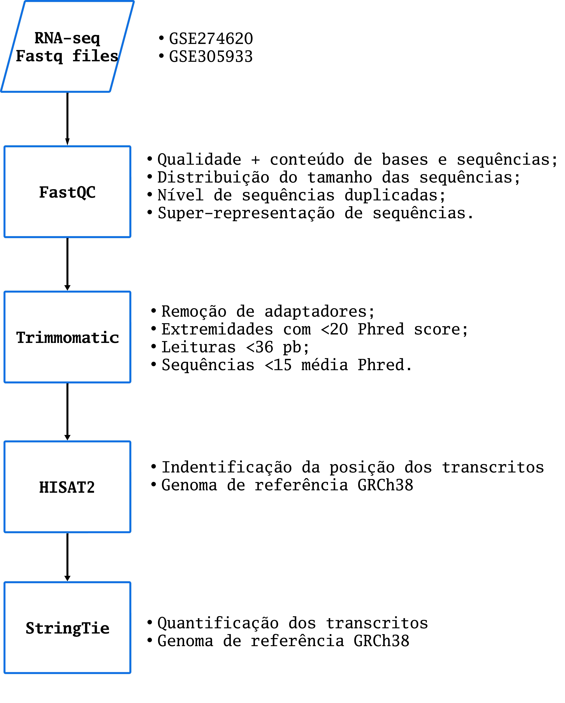

###  5.5.5  MFuzz:
O Mfuzz é um método que utiliza a técnica de agrupamento suave (soft clustering), que permite identificar conjuntos de genes com perfis de expressão semelhantes ao longo do tempo. O Mfuzz possibilita que um mesmo gene pertença simultaneamente a diferentes clusters, com distintos graus de pertinência. Essa abordagem é particularmente relevante em sistemas biológicos complexos, uma vez que muitos genes participam de múltiplos processos celulares e podem apresentar padrões de expressão compartilhados entre diferentes grupos funcionais.

A aplicação do Mfuzz segue uma série de etapas metodológicas. Inicialmente, realiza-se a normalização dos dados, com o objetivo de reduzir vieses técnicos e garantir a comparabilidade entre as amostras. Em dados de RNA-seq, por exemplo, esse processo pode incluir correções relacionadas ao tamanho da biblioteca e ao comprimento dos genes, enquanto em experimentos de microarranjo são aplicados métodos específicos de padronização.

A primeira etapa consistiu na identificação de padrões temporais de expressão gênica utilizando o algoritmo de agrupamento fuzzy implementado no pacote Mfuzz. Inicialmente, os dados de expressão foram transformados para escala logarítmica a fim de reduzir a influência de genes altamente expressos e minimizar diferenças extremas entre as amostras.

Em seguida, é realizada uma filtragem para remoção de transcritos com baixa expressão média, mantendo-se apenas aqueles com média de expressão superior a 1. Posteriormente, os genes foram classificados de acordo com sua variabilidade ao longo do experimento e somente os 10% mais variáveis foram selecionados para as análises subsequentes. Essa estratégia permitiu concentrar a análise nos genes com maior potencial de participação nos eventos biológicos associados à diferenciação celular.

Após a padronização dos dados, o parâmetro de fuzzificação foi estimado automaticamente e os genes foram distribuídos em 12 clusters de expressão temporal. Os perfis obtidos permitiram identificar diferentes tendências de regulação ao longo dos dias analisados, incluindo genes progressivamente ativados, reprimidos ou transitoriamente expressos durante a diferenciação.
	
###  5.5.6  DESeq2:
Para a análise de expressão diferencial foi utilizado o programa DESeq2. Ele necessita da matriz de contadores e metadados para realizar os testes estatísticos e definir os genes diferencialmente expressos. Ele normaliza os contadores com base no tamanho das bibliotecas, utilizando distribuição binomial negativa dos dados como abordagem estatística e ajustando o p-valor pelo método de Benjamini-Hochberg. Para identificação dos genes diferencialmente expressos, o algoritmo utiliza um modelo linear generalizado, calculando a dispersão e fold change. O DESeq2 precisa de uma fórmula de design, que fórmula usa uma coluna dos metadados, de modo que os fatores que a compõem serão comparados entre si. Foram feitas comparações para cada dia que o experimento foi realizado em relação ao controle. Por exemplo, comparou-se a expressão do dia em relação ao controle. Dessa forma, foi possível obter informações do quanto os genes foram mais ou menos expressos naquele dia em relação ao controle, que foi o primeiro dia do experimento. Este período foi escolhido como controle pois espera-se que neste momento a expressão de todos os genes sejam idênticas. 

Escrevemos scripts em bash e R, que realiza a análise de expressão diferencial usando DESeq2. Seguimos o tutorial disponibilizado na plataforma Bioconductor, testando os parâmetros. DESeq2 constrói primeiramente um DESeqDataSet, que armazena os contadores de transcritos e estimativas intermediárias feitas durante a análise estatística. Então, com base no DESeqDataSet, o DESeq2 realiza a análise de expressão diferencial e estima a dispersão dos genes baseado na variável de interesse (neste exemplo, os dias). Comparamos os níveis de expressão dos genes para as amostras presentes em cada dia (1-18 para cardiomiócitos e 1-17 para polihormonais). Ao final, obtivemos resultados de p-valor, q-valor (p-valor ajustado) e log2 fold change dos transcritos. Consideramos como genes up-regulated aqueles com q-valor menor que 0.05, log2 fold change maior que 2 e base mean maior que 50. Por outro lado, consideramos como genes down-regulated aqueles com q-valor maior que 0.05, log2 fold change menor que -2 e base mean menor que 50. 

###  5.5.7   Anotação Funcional:
Anotamos apenas os genes presentes nos módulos mais significativos identificados pelo MFuzz, que também estavam presentes na lista de genes diferencialmente expressos para amostras de cada dia. Utilizamos pacotes da plataforma Bioconductor para realizar os processos de anotação. Assim, os pacotes clusterProfiler, org.Hs.eg.db e AnnotationDbi foram empregados para identificar a ontologia dos genes dos módulos. Para a análise de enriquecimento de via (KEGG), empregamos o pacote enrichplot da plataforma Bioconductor para os mesmos conjuntos de genes foram analisados. 

###  5.5.8  Construção de redes:

#### 5.5.8.1 WGCNA
Com o intuito de identificar a correlação entre os transcritos, pacotes que avaliam a relação da expressão gênica em uma amostra ou grupos de amostras foram utilizados. Essas análises permitem caracterizar o comportamento da expressão de grupos de genes, sendo possível supor que tais genes têm expressão correlacionada, passando pelo mesmo processo de regulação e, possivelmente, são pertencentes à mesma via metabólica. Para esta etapa, utilizamos o programa WGCNA. 

WGCNA (Weighted Correlation Network Analysis) é um pacote em R que permite identificar módulos de genes, que são conjuntos de genes com comportamento de expressão semelhante dentro de grupos de amostras ou de forma seriada (ao longo do tempo, por exemplo). A partir destes módulos, o WGCNA os relaciona com os metadados, fornecendo estimativas quantitativas da força desta relação. 

Primeiramente, é necessário submeter os dados de expressão (matrizes de contadores de transcritos) à filtragem e normalização. É recomendado normalizar os dados por variance stabilizing transformation, uma função do DESeq2 que estabiliza a variância. Dessa forma, construímos o DataSet a partir do metadado de dias. Filtramos os genes cujas leituras somadas para todas as amostras apresentavam total maior que 1000. Assim, normalizamos os contadores filtrados de acordo com sua variância. Essa abordagem se mostra necessária pois minimiza a quantidade de dados a serem trabalhados, agilizando o tempo de processamento.

Para a construção das redes, precisamos converter os contadores normalizados e filtrados à uma matriz de similaridade. Ela mede o nível de concordância entre os perfis de expressão dos genes através do coeficiente de correlação de Pearson. Assim, essa matriz de similaridade é convertida à uma matriz de adjacência. Neste ponto, o peso da rede é determinado por um parâmetro chamado soft thresholding power β. Ele corresponde ao valor pelo qual as correlações são elevadas para calcular a matriz de adjacência com topologia de escala livre aproximada. Nós escolhemos o soft thresholding power β de 18 para os cardiomiócitos e 20 para as polihormonais, pois são os valores em que os dados apresentam alta escala de independência e baixa conectividade média (Figuras 1 e 2). 

> 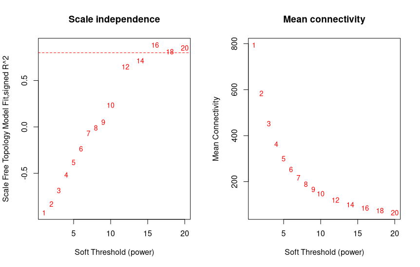
Figura 1: Parâmetro β adotado para a construção da rede de correlação dos dados de cardiomiócitos. À esquerda, relação entre o valor de β e a topologia livre de escala da rede construída; à direita, conectividade média em função do valor β escolhido.

> 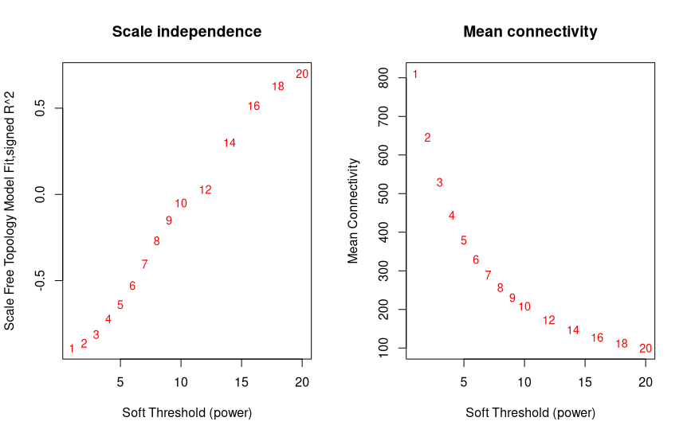
Figura 2: Parâmetro β adotado para a construção da rede de correlação dos dados de células polihormonais. À esquerda, relação entre o valor de β e a topologia livre de escala da rede construída; à direita, conectividade média em função do valor β escolhido.

A matriz de adjacência construída a partir destes parâmetros permite categorizar a força da relação entre os genes (nós) da rede.

O WGCNA usa a sobreposição topológica dos valores de dissimilaridade para detecção de módulos. Assim, calcula-se a sobreposição topológica dos genes, que reflete a alta correlação entre os genes comparados, e subtrai-se 1 desse valor. Os módulos são classificados como grupos de genes com alta sobreposição topológica. 

Os módulos detectados podem ser relacionados com os metadados através de cálculos de correlação de Pearson e p-valor entre o eigengene de cada módulo e os metadados (Figuras 3 e 4).

> 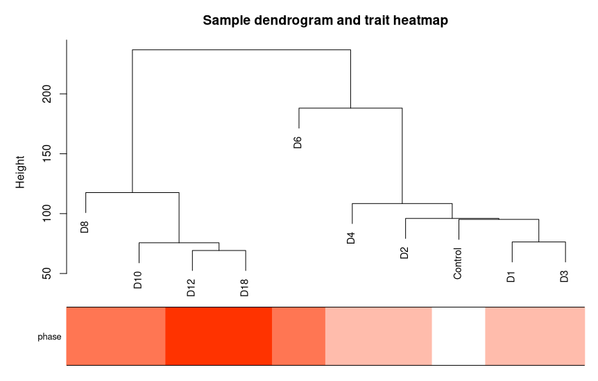
Figura 3: Relação observada pelo algoritmo utilizado para os módulos construídos e os metadados de cardiomiócitos, aqui representados pela coloração do parâmetro ‘phase’ (Early - Dias 1,2,3 e 4; Mid - Dias 6, 8 e 10; Late - Dias 12 e 18; Control - Dia 0).

> 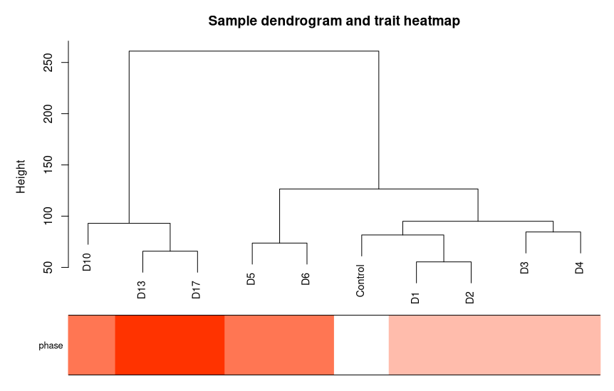
Figura 4: Relação observada pelo algoritmo utilizado para os módulos construídos e os metadados de células polihormonais, aqui representados pela coloração do parâmetro ‘phase’ (Early - Dias 1,2,3 e 4; Mid - Dias 5,6 e 10; Late - Dias 13 e 17; Control - Dia 0).

Eigengene é um vetor que representa um padrão agregado de expressão gênica para os genes dos módulos, calculado por meio da técnica de análise de componentes principais. Ele captura a variabilidade geral dos genes dentro do módulo e fornece uma representação resumida do perfil de expressão desse módulo. Assim, o coeficiente de correlação e o p-valor entre os eigengenes e os metadados foram calculados. 

Dessa forma, como o WGCNA posiciona os genes que não se encaixaram em nenhum perfil de expressão no módulo grey, os módulos turquoise foram selecionados para a construção das redes de co-expressão (Figuras 5 e 6). 

> 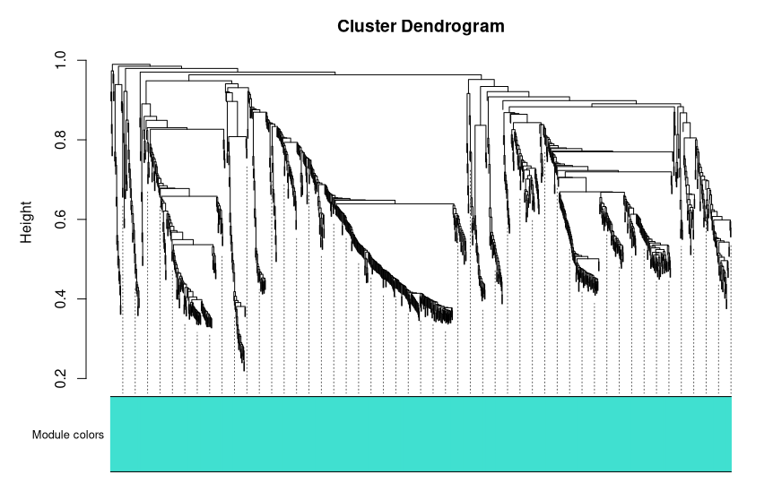
Figura 5: Módulos identificados pelo WGCNA para a rede de expressão de cardiomiócitos.

> 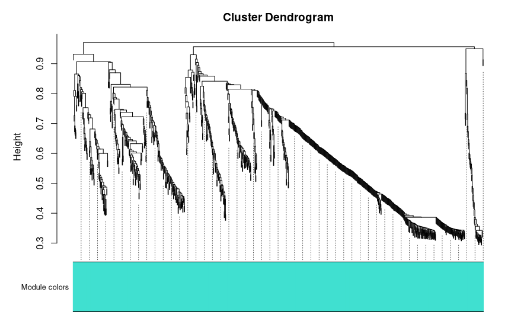
Figura 6: Módulos identificados pelo WGCNA para a rede de expressão de células polihormonais.

Dessa forma, filtramos os genes de cada módulo, mantendo somente aqueles que correspondem aos genes diferencialmente expressos para amostras presentes em cada dia. 

#### 5.5.8.2 Cytoscape
Utilizamos o programa Cytoscape para construção da visualização das redes. Por questões de visualização, selecionamos as arestas que apresentavam peso de ligação maior que 0.1. Utilizamos estratégias de análise de rede para identificar medidas de grau, centralidade, coeficiente de clusterização e valores de eigen gene. Essas métricas foram expressas como cores de nós, que representam o grau de conectividade do gene correspondente, sendo que, quanto mais escura a cor, maior o número de conexões do gene. Este é o princípio para caracterizar os hubs da rede, com parâmetros (número mínimo de conexões) a serem definidos conforme o estudo. Além disso, as cores dos nós também foram utilizadas para demonstrar a expressão dos genes. Quanto mais vermelho, maior o valor de LFC e mais up-regulated aquele gene é em relação a comparação feita do dia em análise com o controle. Quanto mais azul, menor o valor de LFC e mais down-regulated aquele gene é em relação aos dias comparados com o controle. Em relação às medidas de coeficiente de clusterização, é possível identificar a probabilidade de dois vizinhos de um mesmo nó também estarem conectados entre si. Fundamental para identificar módulos funcionais em redes biológicas, já que nós densamente conectados costumam realizar tarefas celulares semelhantes. Por fim, os autovalores (eigenvalues) e autovetores (eigenvectors) são grandezas matemáticas fundamentais usadas para quantificar a influência dos nós, a sincronização e a estabilidade estrutural. Todas essas métricas foram expressas em termos de coloração, das quais as mais escuras representam os maiores valores e as mais claras os menores valores. 

# 6. Análises realizadas + Resultados  :

A análise dos dados foi conduzida por meio de uma abordagem integrada que combinou agrupamento temporal, análise de expressão diferencial, anotação funcional e construção de redes de coexpressão gênica. O objetivo foi identificar padrões de expressão associados ao processo de diferenciação de células tronco embrionárias humanas em cardiomiócitos e células polihormonais, bem como caracterizar os mecanismos biológicos relacionados às alterações observadas ao longo do tempo. 

## 6.1  Análise de componentes principais:
A análise de componentes principais foi utilizada como etapa exploratória para verificar a distribuição global das amostras e a separação entre fases/linhagens. Essa redução de dimensionalidade ajuda a identificar se as amostras se organizam de acordo com a trajetória temporal esperada e se há separação entre o estado controle, fases intermediárias e fases finais (Figuras 7 e 8).

> 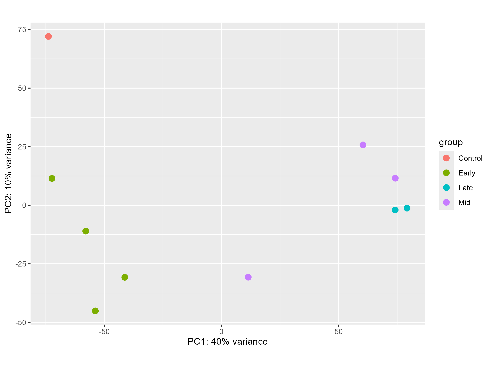
Figura 7: Análise de componentes principais realizada para os dias de diferenciação de células tronco embrionárias humanas em cardiomiócitos. A categorização dos dias, aqui representada pela cor dos pontos, ocorreu de modo a agrupar dias diferentes em grupos específicos: Control - Dia 0; Early - Dias 1, 2, 3 e 4; Mid - Dias 6, 8 e 10; Late - Dias 10 e 18. 

> 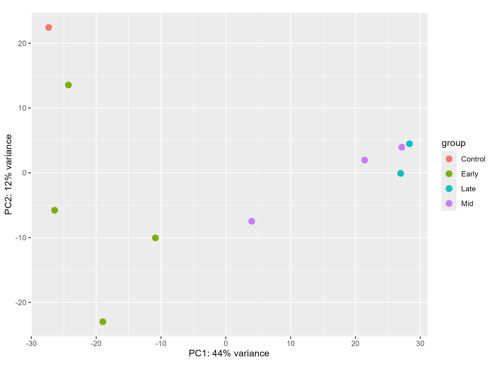
Figura 8: Análise de componentes principais realizada para os dias de diferenciação de células tronco embrionárias humanas em células polihormonais. A categorização dos dias, aqui representada pela cor dos pontos, ocorreu de modo a agrupar dias diferentes em grupos específicos: Control - Dia 0; Early - Dias 1, 2, 3 e 4; Mid - Dias 5, 6 e 10; Late - Dias 13 e 17. 

## 6.2 Análise de séries temporais
A identificação de padrões temporais de expressão gênica foi realizada utilizando o algoritmo MFuzz. Após normalização e filtragem dos dados, os genes mais variáveis ao longo do experimento foram selecionados e agrupados conforme seus perfis de expressão temporal. Ao todo, 12 clusters foram previamente definidos para cada análise, uma vez que tal valor demonstrou-se o mais adequado para os dados utilizados.

Para as etapas posteriores, foram selecionados os genes pertencentes aos clusters que apresentavam perfis de expressão que descrevem tendências claras, como aumento ou diminuição de expressão em conjunto ao longo do tempo. Diferentes clusters foram selecionados para cada grupo celular.  Para os cardiomiócitos, foram selecionados os clusters 1, 2 e 4 (Figura 9). 

> 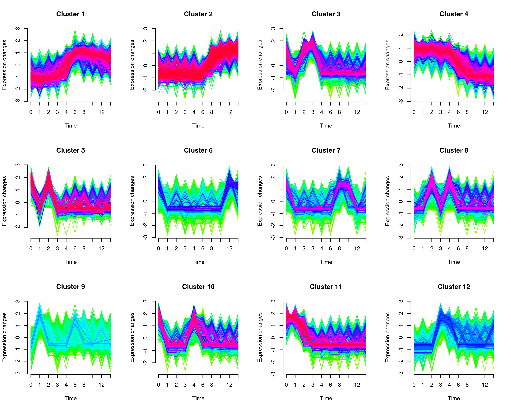
Figura 9: Clusters identificados pelo algoritmo Mfuzz para o processo de diferenciação de células tronco embrionárias humanas em cardiomiócitos. Para cada cluster, observa-se no eixo das abscissas o tempo adotado pelo experimento. Neste caso, os mesmos indicam os dias transcorridos ao longo do experimento. Complementarmente, observa-se no eixo das ordenadas a métrica utilizada pelo algoritmo para a representação da mudança de expressão de cada transcrito ao longo do tempo.

Por sua vez, para as células polihormonais, os clusters 1, 4 e 12 foram selecionados (Figura 10). 
	
> 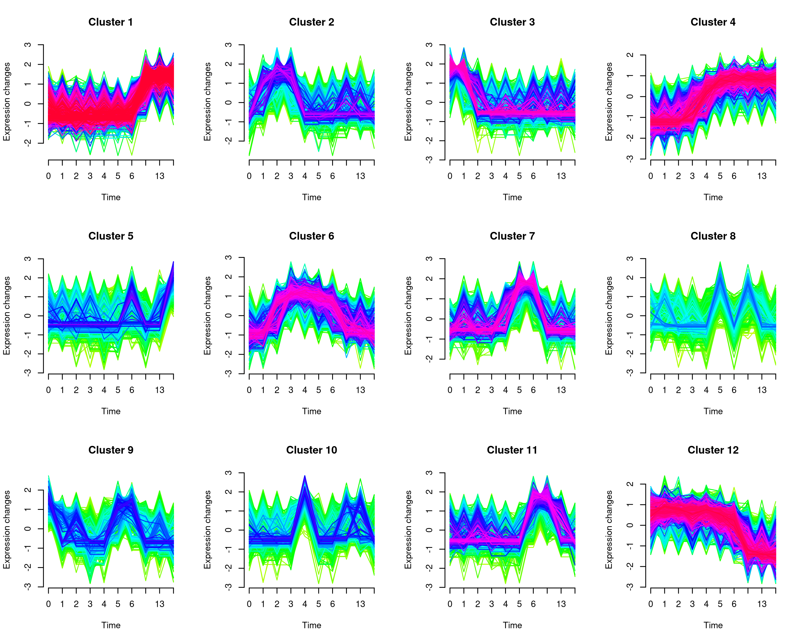
Figura 10: Clusters identificados pelo algoritmo Mfuzz para o processo de diferenciação de células tronco embrionárias humanas em células polihormonais. Para cada cluster, observa-se no eixo das abscissas o tempo adotado pelo experimento. Neste caso, os mesmos indicam os dias transcorridos ao longo do experimento. Complementarmente, observa-se no eixo das ordenadas a métrica utilizada pelo algoritmo para a representação da mudança de expressão de cada transcrito ao longo do tempo.

Por fim, para cada cluster selecionado, apenas transcritos com grau de pertinência superior a 0.7 foram selecionados. Desse modo, restringimos as análises aos genes que melhor representavam os padrões temporais observados.

## 6.3 Análise de expressão diferencial:
Os genes selecionados a partir da análise temporal foram submetidos à análise de expressão diferencial utilizando o pacote DESeq2. A matriz de contagens foi integrada aos metadados experimentais, considerando as diferentes fases da diferenciação como variável de interesse.

Após a normalização e estimação dos parâmetros do modelo estatístico, foram realizadas comparações entre cada ponto temporal (D1, D2, D3, D4, D6, D8, D10, D12 e D18) para os cardiomiócitos e (D1, D2, D3, D4, D5, D6, D10, D13 e D17) para as células polihormonais à respectiva condição de controle de cada experimento (D0). Para cada comparação foram estimados os valores de log₂ fold change, expressão média e significância estatística ajustada para múltiplos testes.

Foram considerados diferencialmente expressos os genes que apresentaram valor ajustado de p inferior a 0.05, valor absoluto de log₂ fold change superior a 2 e expressão média superior a 50. Os genes que atenderam a esses critérios foram classificados com expressão diferencial superior ou inferior em relação ao controle, permitindo acompanhar a dinâmica da expressão gênica ao longo do processo de diferenciação.

Além da identificação dos genes diferencialmente expressos, foi construído um mapa de calor utilizando os valores normalizados por Variance Stabilizing Transformation (VST). Os genes foram organizados de acordo com os agrupamentos previamente identificados pelo Mfuzz, possibilitando a visualização integrada dos padrões temporais e das alterações de expressão observadas em cada fase experimental (Figuras 11 e 12).

> 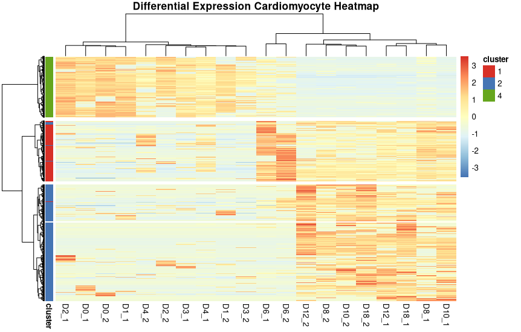
Figura 11: Mapa de calor obtido para os transcritos cuja expressão varia significativamente ao longo do processo de diferenciação de células tronco embrionárias humanas em cardiomiócitos. Neste caso, observa-se o agrupamento dos transcritos a partir dos clusters identificados pelo algoritmo Mfuzz (dendograma horizontal) e o agrupamento a partir dos grupos previamente criados (Control, Early, Mid e Late - dendograma vertical). A cor da célula indica o valor de log2FC para o transcrito em questão em relação ao grupo controle.

> 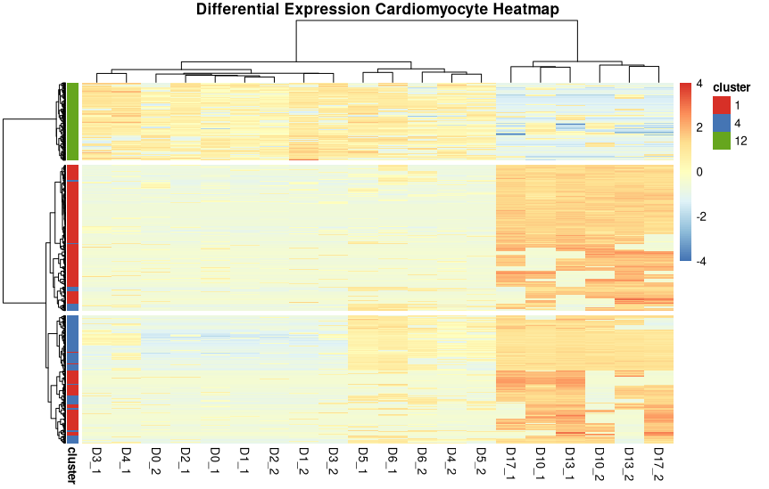
Figura 12: Mapa de calor obtido para os transcritos cuja expressão varia significativamente ao longo do processo de diferenciação de células tronco embrionárias humanas em células polihormonais. Neste caso, observa-se o agrupamento dos transcritos a partir dos clusters identificados pelo algoritmo Mfuzz (dendograma horizontal) e o agrupamento a partir dos grupos previamente criados (Control, Early, Mid e Late - dendograma vertical). A cor da célula indica o valor de log2FC para o transcrito em questão em relação ao grupo controle.

## 6.4 Anotação funcional e Análise de Enriquecimento de Vias:
A interpretação biológica dos genes selecionados foi realizada por meio de análises de anotação funcional e enriquecimento. Foram considerados apenas os genes pertencentes aos clusters de interesse identificados pelo Mfuzz e que também apresentaram expressão diferencial significativa nas comparações realizadas pelo DESeq2.

A anotação foi conduzida utilizando os pacotes clusterProfiler, AnnotationDbi e org.Hs.eg.db, permitindo a associação dos genes a termos da Gene Ontology (GO). Foram avaliadas categorias relacionadas aos domínios de Processo Biológico (Biological Process), Função Molecular (Molecular Function) e Componente Celular (Cellular Component), possibilitando a identificação dos principais processos envolvidos na diferenciação dos cardiomiócitos e células polihormonais (Figuras 13, 14 e 15 - Cardiomiócitos; Figuras 16 e 17 - Células Polihormonais) . 

Figura 13: Anotação funcional realizada para os transcritos pertencentes ao cluster 4 do algoritmo Mfuzz para cardiomiócitos, tendo como base o banco de dados Gene Ontology. O tamanho dos pontos indica a quantidade de genes pertencentes ao processo identificado, enquanto a posição em relação a abscissa indica a confiança na predição da via e a coloração a significância estatística do enriquecimento.

Figura 14: Anotação funcional realizada para os transcritos pertencentes ao cluster 1 do algoritmo Mfuzz para cardiomiócitos, tendo como base o banco de dados Gene Ontology. O tamanho dos pontos indica a quantidade de genes pertencentes ao processo identificado, enquanto a posição em relação a abscissa indica a confiança na predição da via e a coloração a significância estatística do enriquecimento.

Figura 15: Anotação funcional realizada para os transcritos pertencentes ao cluster 2 do algoritmo Mfuzz para cardiomiócitos, tendo como base o banco de dados Gene Ontology. O tamanho dos pontos indica a quantidade de genes pertencentes ao processo identificado, enquanto a posição em relação a abscissa indica a confiança na predição da via e a coloração a significância estatística do enriquecimento.

Figura 16: Anotação funcional realizada para os transcritos pertencentes ao cluster 12 do algoritmo Mfuzz para células polihormonais, tendo como base o banco de dados Gene Ontology. O tamanho dos pontos indica a quantidade de genes pertencentes ao processo identificado, enquanto a posição em relação a abscissa indica a confiança na predição da via e a coloração a significância estatística do enriquecimento.

Figura 17: Anotação funcional realizada para os transcritos pertencentes ao cluster 4 do algoritmo Mfuzz para células polihormonais, tendo como base o banco de dados Gene Ontology. O tamanho dos pontos indica a quantidade de genes pertencentes ao processo identificado, enquanto a posição em relação a abscissa indica a confiança na predição da via e a coloração a significância estatística do enriquecimento.

Adicionalmente, foram realizadas análises de enriquecimento de vias metabólicas utilizando as bases de dados KEGG e Reactome. Os resultados permitiram identificar rotas biológicas significativamente representadas entre os genes selecionados, fornecendo evidências sobre os mecanismos moleculares associados às alterações observadas nos diferentes estágios da diferenciação (Figura 18 - Cardiomiócitos; Figura 19 - Células Polihormonais).

Figura 18: Anotação funcional realizada para os transcritos pertencentes ao cluster 4 do algoritmo Mfuzz para cardiomiócitos, tendo como base o banco de dados KEGG. O tamanho dos pontos indica a quantidade de genes pertencentes ao processo identificado, enquanto a posição em relação a abscissa indica a confiança na predição da via e a coloração a significância estatística do enriquecimento.

Figura 19: Anotação funcional realizada para os transcritos pertencentes ao cluster 1 do algoritmo Mfuzz para células polihormonais, tendo como base o banco de dados Reactome. O tamanho dos pontos indica a quantidade de genes pertencentes ao processo identificado, enquanto a posição em relação a abscissa indica a confiança na predição da via e a coloração a significância estatística do enriquecimento.

A visualização dos enriquecimentos foi realizada com auxílio do pacote enrichplot, permitindo comparar a relevância dos processos biológicos e das vias enriquecidas entre os conjuntos gênicos analisados.

## 6.5 Análise de redes:
Com o objetivo de investigar relações de coexpressão entre os genes diferencialmente expressos, foi realizada uma análise de redes utilizando o pacote WGCNA. Para essa etapa foram empregados os genes previamente identificados como diferencialmente expressos, cujos valores de expressão foram normalizados por Variance Stabilizing Transformation. 

Os genes foram agrupados em módulos de coexpressão utilizando critérios de similaridade topológica, com tamanho mínimo de 150 genes por módulo. Posteriormente, os módulos identificados pelo WGCNA foram correlacionados com as diferentes fases da diferenciação celular. Essa abordagem permitiu identificar conjuntos de genes cuja expressão apresentou associação significativa com etapas específicas do desenvolvimento celular.

A correlação entre módulos e fenótipos foi avaliada por meio dos eigengenes dos módulos, gerando uma matriz de correlação acompanhada dos respectivos valores de significância estatística. Entre os módulos identificados, os módulos turquoise para ambas as linhagens foram selecionados para análises mais detalhadas, devido à associação com as condições experimentais.

Para caracterização das interações gênicas, a rede correspondente ao módulo selecionado foi exportada para o Cytoscape. Foram mantidas apenas interações com peso superior a 0.1, permitindo destacar conexões biologicamente mais relevantes e facilitar a identificação de genes centrais potencialmente envolvidos na regulação dos processos observados (Vídeos 1 e 2).

https://drive.google.com/file/d/1N09YEjhDVRsfbJDilamfAv2h_d2F7ilN/view?usp=sharing

Vídeo 1: Rede de coexpressão construída a partir de dados de expressão gênica de células tronco embrionárias humanas quando submetidas ao processo de diferenciação para cardiomiócitos. Os nós indicam genes cuja expressão varia significativamente ao longo do período experimental. A mudança de cor dos nós explicita a dinâmica de expressão dos genes ao passar dos dias. Cores avermelhadas indicam aumento da métrica log2FC, enquanto cores azuis denotam diminuição da métrica.  

https://drive.google.com/file/d/1zXvSmzExBpdjgjw8QveS-sU9sw-EpjkC/view?usp=sharing

Vídeo 2: Rede de coexpressão construída a partir de dados de expressão gênica de células tronco embrionárias humanas quando submetidas ao processo de diferenciação para células polihormonais. Os nós indicam genes cuja expressão varia significativamente ao longo do período experimental. A mudança de cor dos nós explicita a dinâmica de expressão dos genes ao passar dos dias. Cores avermelhadas indicam aumento da métrica log2FC, enquanto cores azuis denotam diminuição da métrica.

As redes foram exportadas para o Cytoscape, onde foram avaliadas métricas como grau, centralidade, coeficiente de clusterização e modularidade.

# 7. Discussão:

## 7.1 Cardiomiocitos:

### 7.1.1 Etapas de Diferenciação:
De modo geral, a capacidade de divisão de uma célula está diretamente relacionada ao seu grau de diferenciação, de modo que, células altamente indiferenciadas apresentam grande capacidade de divisão. Por outro lado, células cujo estágio de diferenciação se aproxima do estágio terminal muitas vezes são incapazes de se dividir (Júnior; Wada; Carvalho, 2013). Nesse sentido, a partir da análise de enriquecimento estabelecida para o cluster 4 (Figura 13), destaca-se a ativação de vias essenciais para a proliferação celular nos estágios iniciais do processo de diferenciação: a replicação do DNA, a organização do fuso mitótico e o reparo do material genético. Adicionalmente, de acordo com o comportamento temporal do cluster analisado (Figura 9) e seu respectivo mapa de calor (Figura 11), observa-se a gradual diminuição de expressão de tais genes a partir do quarto dia de diferenciação, os quais se mantêm reprimidos durante as etapas finais da especiação. Dessa forma, torna-se evidente a relativa perda na capacidade de divisão por parte das células indiferenciadas ao longo do processo de diferenciação, sendo os cardiomiócitos incapazes de se dividir quando terminalmente diferenciados (Júnior; Wada; Carvalho, 2013). 

Em contrapartida, tratando-se de genes cuja expressão aumenta com o decorrer do processo de diferenciação, evidencia-se a ativação de processos diretamente relacionados à determinação do mesoderma cardíaco (Figura 14) por volta do sexto dia de experimentação (Figuras 9 e 11). Nesse sentido, entende-se como determinação o conjunto de modificações autoperpetuáveis de caráter interno que distinguem uma célula, assim como suas descendentes, das demais células do embrião (Júnior; Wada; Carvalho, 2013). Finalmente, transcorrida a determinação, observa-se a ativação de vias gênicas diretamente responsáveis pela diferenciação e manutenção do fenótipo cardíaco (Figura 15), as quais ativam-se tardiamente quando comparadas à determinação do mesoderma cardíaco (Figuras 9 e 11).

### 7.1.2 Rede e Graus:
Tendo como intuito a identificação de genes centrais para a diferenciação de células tronco embrionárias humanas em cardiomiócitos, diferentes métricas foram aplicadas à rede construída, sendo o grau dos nós escolhido para avaliação (Figura 20).

> 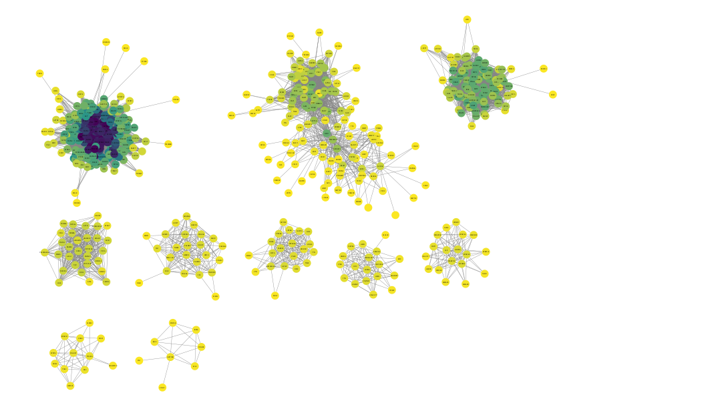
Figura 20: Rede de coexpressão construída a partir de dados de expressão gênica de células tronco embrionárias humanas quando submetidas ao processo de diferenciação para cardiomiócitos. Neste caso, observa-se a partir da coloração dos nós seus respectivos graus, de modo que, quanto mais escuro a coloração de um nó, maior o seu grau.

Por meio da rede gerada, foram identificados os genes cujas medidas de grau apresentam-se consideravelmente altas, tendo como destaque o conjunto de genes evidenciados pela Figura 20 e pertencentes à sub-rede superior à esquerda. Dessa maneira, tendo em vista as propriedades da sub-rede destacada, a mesma foi selecionada para a averiguação do comportamento da expressão gênica de seus componentes ao longo do tempo (Vídeo 3).

https://drive.google.com/file/d/13MqhUL1D5DebEIFYol0VGXsO-orqfOui/view?usp=sharing

Vídeo 3: Análise da variação da expressão gênica dos componentes da sub-rede destacada. A mudança de cor dos nós explicita a dinâmica de expressão dos genes ao passar dos dias. Cores avermelhadas indicam aumento da métrica log2FC, enquanto cores azuis denotam diminuição da métrica. 

De acordo com a análise da rede em questão, ressaltam-se três genes de alto grau e cuja expressão aumenta significativamente a partir do sexto dia: ACTN2, MYH6 e TBX5. No que diz respeito aos genes ACTN2 e MYH6, estes caracterizam-se por codificar proteínas estruturais que compõem os sarcômeros. Em contrapartida, o gene TBX5 caracteriza-se por codificar um fator de transcrição da família T-box, sendo conhecido por sua função no desenvolvimento dos membros superiores e do coração. 

Tratando-se do ACTN2, ressalta-se sua importância na estruturação correta dos discos Z dos sarcômeros, uma vez que o mesmo é responsável por codificar a alpha-actinina-2, crucial para a ligação dos filamentos de actina e pela estabilização do aparato de contração cardíaca ​​(Good et al., 2020)​. De maneira complementar, o gene MYH6 mostra-se essencial para a correta formação da miosina presente nos sarcômeros, estando relacionado à codificação da subunidade de cadeia pesada alfa pesada α da miosina cardíaca no sarcômero ​​(Daire et al., 2025)​. 

Quanto ao TBX5, evidencia-se sua relevância para a correta septação cardíaca, estando o fator de transcrição associado à ativação de genes responsáveis pela maturação dos cardiomiócitos durante a embriogênese ​​(Steimle; Moskowitz, 2017)​. Efetivamente, em virtude de sua importância para o correto desenvolvimento embrionário, mutações no gene TBX5 relacionam-se à distintas malformações no sistema cardíaco, assim como nos membros superiores (Møller Nielsen et al., 2024).   

Dessa forma, tendo em vista a importância de tais genes na correta formação da estrutura cardíaca, destaca-se a necessidade da correta ativação dos mesmos após a determinação do mesoderma cardíaco (dia 6), os quais mantém expressão considerável até o último dia avaliado. 

### 7.1.3 Módulos:
Tendo como base a sub-rede previamente analisada (Vídeo 3), foi realizada a aplicação do algoritmo de Leiden para a determinação de comunidades, no intuito de aprofundar o entendimento acerca dos principais genes envolvidos na diferenciação de células tronco embrionárias em cardiomiócitos (Figura 21).
 	
> 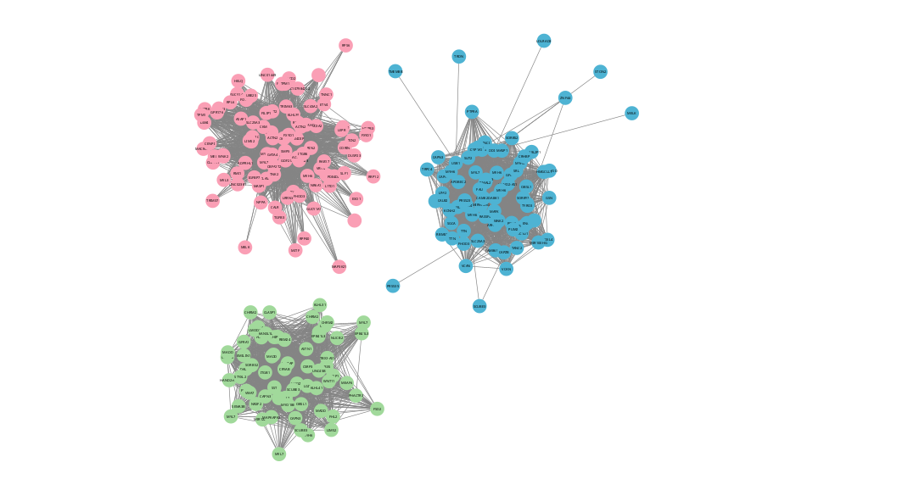
Figura 21: Comunidades obtidas a partir da aplicação do algoritmo de Leiden à sub-rede destacada. Ao todo, 3 comunidades foram encontradas, aqui diferenciadas pela coloração dos nós.

Mediante a rede gerada, foi avaliado o comportamento de seus genes constituintes frente à métrica log2FC para os dias analisados (Vídeo 4). 

https://drive.google.com/file/d/1pr04cexyhapkJIXOc_zq9DDPPk7PiA83/view?usp=sharing

Vídeo 4: Análise da variação da expressão gênica dos componentes constituintes das comunidades encontradas. A mudança de cor dos nós explicita a dinâmica de expressão dos genes ao passar dos dias. Cores avermelhadas indicam aumento da métrica log2FC, enquanto cores azuis denotam diminuição da métrica. 

Em vista disso, evidencia-se o comportamento do gene NR6A1, pertencente à comunidade rosa (Figura 21), cuja expressão se mantém alta durante os primeiros dias de desenvolvimento embrionário mas que, a partir do terceiro dia, apresenta redução na expressão (Figura 22).

> 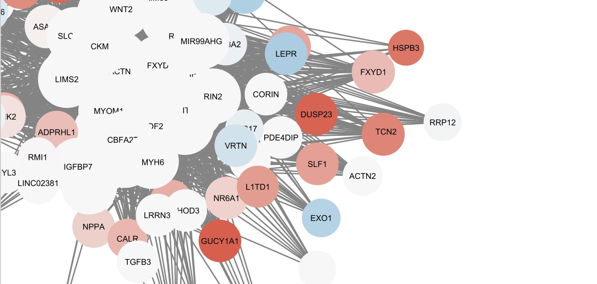
Figura 22: Expressão dos genes constituintes da comunidade rosa ao terceiro dia de experimentação.

O gene em questão caracteriza-se pela codificação de um receptor nuclear órfão, ou seja, que não possuí ligante conhecido. Sua atividade no núcleo baseia-se, principalmente, na repressão da transcrição de genes específicos, dentre os quais destaca-se o gene Oct4, responsável pela codificação de um fator de transcrição ativamente envolvido na promoção de pluripotência (REFs). Por conseguinte, torna-se evidente a atividade de repressor por parte do receptor NR6A1 para a regulação fina do fator de transcrição Oct4, garantindo que a célula restrinja sua capacidade de pluripotência apenas aos primeiros estágios da diferenciação celular.

## 7.2 Polihormonais:
### 7.2.1 Etapas de Diferenciação:
As células polihormonais caracterizam-se principalmente por sua capacidade de produção, armazenamento e secreção dos hormônios insulina e glucagon (Peterson et al., 2020).  Notavelmente, terminadas as etapas subsequentes do processo de diferenciação de células polihormonais em células β e α, a capacidade de produção dos hormônios insulina e glucagon se manterá restrita, respectivamente, aos tipos celulares citados. Além disso, observa-se que a própria organização das células β e α se mantém restrita a localidades específicas no pâncreas, uma vez que tais tipos celulares agrupam-se em regiões conhecidas, as chamadas ilhotas de Langerhans ​​(Nostro; Keller, 2012)​.  

No tocante ao processo de diferenciação de células tronco embrionárias humanas em células polihormonais, ressalta-se, inicialmente (Cluster 12 - Figura 10), a ativação de genes diretamente envolvidos pelo comprometimento à linhagem endodermal, folheto embrionário responsável por originar as células endócrinas (Figura 16). Como indicado pelos resultados, tais genes apresentam expressão relativamente constante durante os seis primeiros dias do processo de diferenciação (Figuras 10 e 12), tempo este maior do que aquele observado para os fatores inicialmente envolvidos na determinação do mesoderma cardíaco (Figuras 9 e 11).

Relativamente aos clusters cujos genes apresentam aumento de expressão com o decorrer do tempo de experimentação (Clusters 1 e 4 - Figura 10), destaca-se a ativação após o terceiro dia de fatores responsáveis pela correta localização espacial do tipo celular em questão. Como citado anteriormente, as células polihormonais caracterizam-se por originarem os tipos celulares que formarão as ilhotas de Langerhans. Consequentemente, torna-se evidente a necessidade de ativação de genes responsáveis pelos processos de delaminação e migração celular ​​(Bakhti et al., 2022a)​, responsáveis, respectivamente, pela liberação da célula de sua matriz extracelular e pela correta agregação nas ilhotas de Langerhans (Figura 17). 

Finalmente, apenas após seis dias do processo de diferenciação, fatores explicitamente responsáveis pela formação de células endócrina se expressam, como o marcador Ngn3, um fator de transcrição responsável pela geração de precursores endócrinos ​​(Bakhti et al., 2022a)​. Por conseguinte, estes comportamentos reforçam as descobertas de Keskin et al. (2025, 2026), demonstrando a diferença de ativação temporal entre os fatores gênicos responsáveis pela maturação de cardiomiócitos e células polihormonais.

### 7.2.2 Rede e Graus:
De maneira análoga à abordagem adotada para a interpretação da rede de diferenciação de cardiomiócitos, diferentes métricas foram aplicadas à rede de diferenciação de células polihormonais construída, sendo o grau dos nós novamente escolhido para avaliação (Figura 23).

> 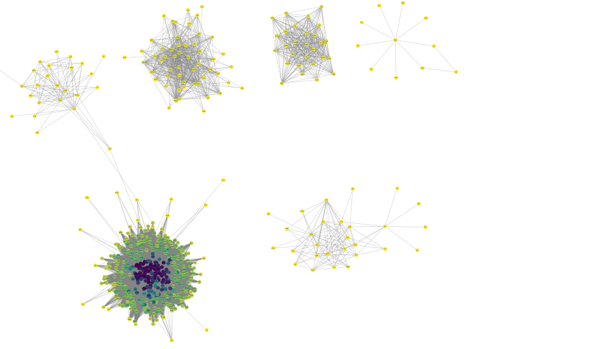
Figura 23: Rede de coexpressão construída a partir de dados de expressão gênica de células tronco embrionárias humanas quando submetidas ao processo de diferenciação para células polihormonais. Neste caso, observa-se a partir da coloração dos nós seus respectivos graus, de modo que, quanto mais escuro a coloração de um nó, maior o seu grau.
	
Com base na rede obtida, destaca-se a prevalência de nós com alto grau na maior sub-rede em questão, esta selecionada para a análise de expressão diferencial ao longo do tempo (Vídeo 5).

https://drive.google.com/file/d/1esxFGVM774VA2xvuK3FhfHCIlWwNIxlg/view?usp=sharing

Vídeo 5: Análise da variação da expressão gênica dos componentes da sub-rede destacada. A mudança de cor dos nós explicita a dinâmica de expressão dos genes ao passar dos dias. Cores avermelhadas indicam aumento da métrica log2FC, enquanto cores azuis denotam diminuição da métrica. 

Tendo em vista a rede gerada, destacam-se os comportamentos de dois genes específicos, estes com alto grau e relativo aumento de expressão após o décimo dia: CRB2 e ADGRG6. Neste caso, ambos os genes codificam proteínas transmembranas, as quais são essenciais para o processo de mecanosinalização. Por meio da ativação de vias específicas, tais proteínas transduzem o sinal proveniente da matriz extracelular em respostas bioquímicas específicas, coordenando a liberação da célula de sua matriz e a migração para regiões específicas (Geusz et al., 2021; Li et al., 2025)​. 

Dessa forma, em virtude da importância da migração celular para a formação das ilhotas de Langerhans, ressalta-se a importância da ativação de fatores migratórios a momentos específicos do processo de diferenciação celular, uma vez que estes mesmos fatores, quando superativados, podem levar à excessiva migração celular e formação de metástases. 

### 7.2.3  Módulos
Fundamentando-se na sub-rede previamente analisada (Vídeo 5), foi realizada a aplicação do algoritmo de Leiden para a determinação de comunidades, no intuito de aprofundar o entendimento acerca dos principais genes envolvidos na diferenciação de células tronco embrionárias em células polihormonais (Figura 24).

> 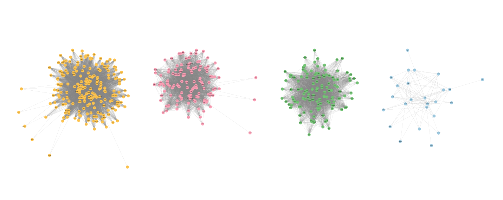
Figura 24: Comunidades obtidas a partir da aplicação do algoritmo de Leiden à sub-rede destacada. Ao todo, 4 comunidades foram encontradas, aqui diferenciadas pela coloração dos nós.

Mediante a rede gerada, foi avaliado o comportamento de seus genes constituintes frente à métrica log2FC para os dias analisados (Vídeo 6).

https://drive.google.com/file/d/1Pe47l6oSFVPMw-pRacbECYPjZsi2MFBd/view?usp=sharing

Vídeo 6: Análise da variação da expressão gênica dos componentes constituintes das comunidades encontradas. A mudança de cor dos nós explicita a dinâmica de expressão dos genes ao passar dos dias. Cores avermelhadas indicam aumento da métrica log2FC, enquanto cores azuis denotam diminuição da métrica.

Dentre os genes destacados pela rede em questão, ressalta-se o gene HMGCR, codificante para uma enzima de mesmo nome. A enzima HMGCR é constituinte fundamental da via de produção de colesterol, catalisando a conversão da 3-hidroxi-3-metilglutaril-coenzima A em ácido mevalônico ​​(Yang et al., 2025)​. Sua hiperatividade é característica de células cancerígenas, sendo constantemente utilizada como alvo terapêutico na progressão do tumor ​​(Yang et al., 2025)​. Em contrapartida, no que diz respeito à diferenciação das células endócrinas, a HMGCR destaca-se pela participação na formação de células β, principais produtoras de insulina (Takei et al., 2020). À vista disso, nocautes da enzima em células  murinas demonstraram relação direta a malformação de células β, prejudicando, dessa maneira, a produção de insulina e levando à diagnósticos de diabetes recente (Takei et al., 2020). 

## 7.3 Rede Merged: 

Em conclusão, por meio da intersecção de ambas as redes construídas (Vídeos 1 e 2), os genes diferencialmente expressos comuns aos dois processos de diferenciação foram identificados, assim como suas respectivas relações aos demais componentes da rede (Vídeo 7).

https://drive.google.com/file/d/1ZGi0DBOVIKfXi7uV_HSGFmZX2xWty1xS/view?usp=sharing

Vídeo 7: Rede resultante da intersecção das redes de coexpressão gênica para o processo de diferenciação de células tronco embrionárias humanas em cardiomiócitos e células polihormonais. Neste caso, visualizam-se apenas nós e arestas comuns entre as redes estudadas. O tamanho dos nós reflete o grau dos mesmos. No que diz respeito à coloração dos nós, esta indica a diferença entre a expressão do gene para os dias específicos, comparando-se o processo de diferenciação de cardiomiócitos e células polihormonais. Quanto mais escura a cor do nó, maior a diferença relativa na expressão do gene entre os processos de diferenciação no dia específico.

A análise da rede construída possibilitou a identificação de componentes essenciais aos dois processos de diferenciação, dentre os quais destaca-se o gene GFRA1, presente no maior componente da rede analisada e codificante para um receptor de membrana da família GDNF (Vídeo 7). Sua expressão mostra-se relativamente tardia nos processos analisados, sendo ativado a partir do oitavo dia para os cardiomiócitos e apenas após o décimo dia para as células polihormonais, mas em maior magnitude de expressão.

No que concerne à atividade do receptor na formação das células cardíacas, este caracteriza-se pela participação no amadurecimento das válvulas e da aorta, sendo expresso no mesênquima do coxim endocárdico por volta do décimo segundo dia do desenvolvimento embrionário (Hiltunen et al., 2000). Por outro lado, a expressão do receptor no desenvolvimento de células endócrinas relaciona-se diretamente com a inervação parassimpática do pâncreas, de modo a coordenar a migração de células da crista neural para o epitélio pancreático ​​(Ishida et al., 2016)​. Em suma, por meio da avaliação dos componentes comuns aos processos de diferenciação, mecanismos essenciais ao desenvolvimento embrionário podem ser elucidados, bem como suas dinâmicas temporais de expressão. 

# 8. Conclusão:

As análises indicam que cardiomiócitos e células polihormonais apresentam trajetórias distintas de expressão gênica durante a diferenciação. No geral, foram identificados módulos e genes associados a processos específicos, como contração cardíaca, organização sarcomérica, diferenciação endócrina, processamento hormonal e transições celulares.

Os resultados rejeitam a hipótese nula (H0) e apoiam a hipótese alternativa (H1), indicando que existem módulos gênicos específicos associados a transições críticas da diferenciação de hESCs. Em conjunto, os achados demonstram que a integração entre expressão diferencial, análise temporal e redes de coexpressão permite caracterizar de forma mais robusta os programas regulatórios envolvidos na aquisição de identidades celulares distintas.

# 9. Trabalhos Futuros:
Com mais tempo, seria possível realizar análises de expressão diferencial e construir redes de coexpressão específicas para cada dia de diferenciação. Essa abordagem permitiria acompanhar de forma mais detalhada as mudanças nos perfis de expressão e nas relações de correlação entre os genes ao longo do tempo, identificando reguladores e módulos característicos de cada fase do processo.

Como desdobramento do projeto, o protótipo de visualização poderia ser transformado em uma ferramenta interativa e reprodutível, permitindo o carregamento de dados pelo usuário, aplicação de filtros temporais e exportação de redes. Além disso, a integração com bancos de expressão tecidual e visualizações anatômicas tridimensionais poderia ampliar o potencial da plataforma para geração de hipóteses biológicas e exploração de outros contextos além da diferenciação cardíaca.

# 10. Referências Bibliográficas

[Bakhti et al., 2022] BAKHTI, Mostafa et al. Synaptotagmin-13 orchestrates pancreatic endocrine cell egression and islet morphogenesis. Nature Communications, v. 13, n. 1, p. 4540, 2022.

[Bastian et al., 2009] BASTIAN, Mathieu; HEYMANN, Sebastien; JACOMY, Mathieu. Gephi: an open source software for exploring and manipulating networks. In: INTERNATIONAL AAAI CONFERENCE ON WEB AND SOCIAL MEDIA, 3., 2009, Burnaby. Proceedings [...]. Burnaby: AAAI Press, 2009. p. 361–362.

[Bolger et al., 2014] BOLGER, Anthony M.; LOHSE, Marc; USADEL, Bjoern. Trimmomatic: a flexible trimmer for Illumina sequence data. Bioinformatics, v. 30, n. 15, p. 2114–2120, 2014.

[Campbell et al., 2019] CAMPBELL, Madeline et al. Stem cell spheroids. 2019.

[Carlson, 2017] CARLSON, Marc. org.Hs.eg.db: Genome wide annotation for Human. R package version 3.5.0, 2017.

[Daire et al., 2025] DAIRE, Elise et al. MYH6 in congenital heart defects: a genotype–phenotype characterization in a French cohort. Pediatric Cardiology, 2025.

[Dobin et al., 2013] DOBIN, Alexander et al. STAR: ultrafast universal RNA-seq aligner. Bioinformatics, v. 29, n. 1, p. 15–21, 2013. DOI: 10.1093/bioinformatics/bts635.

[Dvash et al., 2006] DVASH, Tomer; BEN-YOSEF, Dafna; EIGES, Rachel. Human embryonic stem cells as a powerful tool for studying human embryogenesis. Pediatric Research, v. 60, p. 111–117, 2006. DOI: 10.1203/01.pdr.0000228349.24676.17.

[Geusz et al., 2021] GEUSZ, Ryan J. et al. Pancreatic progenitor epigenome maps prioritize type 2 diabetes risk genes with roles in development. eLife, v. 10, 2021.

[Good et al., 2020] GOOD, Jean-Marc et al. ACTN2 variant associated with a cardiac phenotype suggestive of left-dominant arrhythmogenic cardiomyopathy. HeartRhythm Case Reports, v. 6, n. 1, p. 15–19, 2020.

[Hammachi et al., 2012] HAMMACHI, Fella et al. Transcriptional activation by Oct4 is sufficient for the maintenance and induction of pluripotency. Cell Reports, v. 1, n. 2, p. 99–109, 2012.

[PetaGene, 2026] HISAT2 benchmarked with PetaGene’s compression and transparent readback tools. PetaGene. Disponível em: https://www.petagene.com/a-practical-example-of-hisat2-smaller-files-same-tools-faster-analysis/. Acesso em: 20 abr. 2026.

[Hiltunen et al., 2000] HILTUNEN, Jukka O. et al. GDNF family receptors in the embryonic and postnatal rat heart and reduced cholinergic innervation in mice hearts lacking Ret or GFRα2. Developmental Dynamics, v. 219, n. 1, p. 28–39, 2000.

[Huang et al., 2022] HUANG, Xiaoling et al. Evolution of gene expression signature in mammary gland stem cells from neonatal to old mice. Cell Death & Disease, v. 13, n. 4, p. 335, 2022.

[HPSCREG, 2026] HPSCREG. Human Pluripotent Stem Cell Registry. Disponível em: https://hpscreg.eu. Acesso em: 19 mar. 2026.

[Júnior; Wada; Carvalho, 2013] JÚNIOR, Arnaldo; WADA, Maria; CARVALHO, Hernandes. Diferenciação celular. In: A célula. 3. ed. Barueri: Manole, 2013. p. 553–570.

[Keskin et al., 2025] KESKIN, A.; SHAYYA, H. J.; SIRABELLA, D. et al. Temporal multiomics gene expression data of human embryonic stem cell-derived cardiomyocyte differentiation. Scientific Data, v. 12, p. 1308, 2025. DOI: 10.1038/s41597-025-05655-9.

[Keskin et al., 2025a] KESKIN, A. et al. Temporal multiomics gene expression data of human embryonic stem cell-derived cardiomyocyte differentiation. NCBI Gene Expression Omnibus (GEO), 2025. Disponível em: https://identifiers.org/geo/GSE274620.

[Keskin et al., 2025b] KESKIN, A. et al. Temporal multiomics gene expression data across human embryonic stem cell-derived polyhormonal cell differentiation. NCBI Gene Expression Omnibus (GEO), 2025. Disponível em: https://identifiers.org/geo/GSE305933.

[Keskin et al., 2026] KESKIN, A.; SHAYYA, H. J.; PATEL, A. et al. Temporal multiomics gene expression data across human embryonic stem cell-derived polyhormonal cell differentiation. Scientific Data, v. 13, p. 278, 2026. DOI: 10.1038/s41597-026-06606-8.

[Langfelder; Horvath, 2008] LANGFELDER, Peter; HORVATH, Steve. WGCNA: an R package for weighted correlation network analysis. BMC Bioinformatics, v. 9, p. 559, 2008.

[Lee; Lee, 2011] LEE, Jung Eun; LEE, Dae Ryong. Human embryonic stem cells: derivation, maintenance and cryopreservation. International Journal of Stem Cells, v. 4, n. 1, p. 9–17, 2011. DOI: 10.15283/ijsc.2011.4.1.9.

[Li et al., 2025] LI, Lisha et al. ADGRG6 promotes pancreatic adenocarcinoma progression through the NF-κB/STAT6 axis and modulation of the tumor immune microenvironment. Current Issues in Molecular Biology, v. 47, n. 12, p. 991, 2025.

[Love et al., 2014] LOVE, Michael I.; HUBER, Wolfgang; ANDERS, Simon. Moderated estimation of fold change and dispersion for RNA-seq data with DESeq2. Genome Biology, v. 15, p. 550, 2014.

[Mao; Mooney, 2015] MAO, Angelo S.; MOONEY, David J. Regenerative medicine: current therapies and future directions. Proceedings of the National Academy of Sciences, v. 112, n. 47, p. 14452–14459, 2015.

[Møller Nielsen et al., 2024] MØLLER NIELSEN, Anne Kathrine et al. TBX5 variants and cardiac phenotype: a systematic review of the literature and a novel variant. European Journal of Medical Genetics, v. 68, p. 104920, 2024.

[Muñoz-Bravo et al., 2013] MUÑOZ-BRAVO, José Luis et al. GDNF is required for neural colonization of the pancreas. Development, v. 140, n. 17, p. 3669–3679, 2013.

[Nostro; Keller, 2012] NOSTRO, Maria Cristina; KELLER, Gordon. Generation of beta cells from human pluripotent stem cells: potential for regenerative medicine. Seminars in Cell & Developmental Biology, v. 23, n. 6, p. 701–710, 2012.

[Osipovich et al., 2021] OSIPOVICH, Anna B. et al. A developmental lineage-based gene co-expression network for mouse pancreatic β-cells reveals a role for Zfp800 in pancreas development. Development, v. 148, n. 6, 2021.

[Pagès et al., 2025] PAGÈS, Hervé et al. AnnotationDbi: manipulation of SQLite-based annotations in Bioconductor. R package version 1.72.0, 2025. Disponível em: https://bioconductor.org/packages/AnnotationDbi.

[Pertea et al., 2015] PERTEA, Mihaela et al. StringTie enables improved reconstruction of a transcriptome from RNA-seq reads. Nature Biotechnology, v. 33, n. 3, p. 290–295, 2015. DOI: 10.1038/nbt.3122.

[Peterson et al., 2020] PETERSON, Quinn P. et al. A method for the generation of human stem cell-derived alpha cells. Nature Communications, v. 11, n. 1, p. 2241, 2020.

[BioCore CRG, 2026] READ QC and trimming. Disponível em: https://biocorecrg.github.io/PHINDaccess_RNAseq_2020/qc_trimming.html. Acesso em: 17 abr. 2026.

[Shannon et al., 2003] SHANNON, Paul et al. Cytoscape: a software environment for integrated models of biomolecular interaction networks. Genome Research, v. 13, n. 11, p. 2498–2504, 2003.

[Steimle; Moskowitz, 2017] STEIMLE, Julia D.; MOSKOWITZ, Ivan P. TBX5: a key regulator of heart development. Current Topics in Developmental Biology, v. 122, p. 195–221, 2017. DOI: 10.1016/bs.ctdb.2016.08.008.

[Takei et al., 2020] TAKEI, Shoko et al. β-Cell–specific deletion of HMG-CoA reductase causes overt diabetes due to reduction of β-cell mass and impaired insulin secretion. Diabetes, v. 69, n. 11, p. 2352–2363, 2020.

[Thomson et al., 1998] THOMSON, James A. et al. Embryonic stem cell lines derived from human blastocysts. Science, v. 282, n. 5391, p. 1145–1147, 1998. DOI: 10.1126/science.282.5391.1145.

[Trapnell et al., 2014] TRAPNELL, Cole et al. The dynamics and regulators of cell fate decisions are revealed by pseudotemporal ordering of single cells. Nature Biotechnology, v. 32, n. 4, p. 381–386, 2014. DOI: 10.1038/nbt.2859.

[Wang; Cooney, 2013] WANG, Qin; COONEY, Austin J. Revisiting the role of GCNF in embryonic development. Seminars in Cell & Developmental Biology, v. 24, n. 10–12, p. 679–686, 2013.

[Wen, 2017] WEN, Guangyu. A simple process of RNA-sequence analyses by Hisat2, Htseq and DESeq2. In: INTERNATIONAL CONFERENCE ON BIOMEDICAL ENGINEERING AND BIOINFORMATICS, 2017. Proceedings [...]. 2017. p. 11–15.

[Wingett; Andrews, 2018] WINGETT, Steven W.; ANDREWS, Simon. FastQ Screen: a tool for multi-genome mapping and quality control. F1000Research, v. 7, p. 1338, 2018. DOI: 10.12688/f1000research.15931.2.

[Xu et al., 2023] XU, Rui et al. Abordagem de bioinformática e biologia de sistemas para identificar a ligação patogenética entre insuficiência cardíaca e sarcopenia. Arquivos Brasileiros de Cardiologia, v. 120, n. 10, 2023.

[Yang et al., 2025] YANG, Yisong et al. HMGCR: a malignancy hub – frontiers in cancer diagnosis and therapy. Frontiers in Oncology, v. 15, 2025.

[Yu, 2024] YU, Guangchuang. Thirteen years of clusterProfiler. The Innovation, v. 5, n. 6, p. 100722, 2024. DOI: 10.1016/j.xinn.2024.100722.

[Yu, 2026] YU, Guangchuang. enrichplot: visualization of functional enrichment result. R package version 1.30.5, 2026. Disponível em: https://bioconductor.org/packages/enrichplot.

[Zakrzewski et al., 2019] ZAKRZEWSKI, Wojciech et al. Stem cells: past, present, and future. Stem Cell Research & Therapy, v. 10, n. 1, p. 68, 2019.

[Zeineddine et al., 2014] ZEINEDDINE, Dana et al. The Oct4 protein: more than a magic stemness marker. American Journal of Stem Cells, v. 3, n. 2, p. 74–82, 2014.

